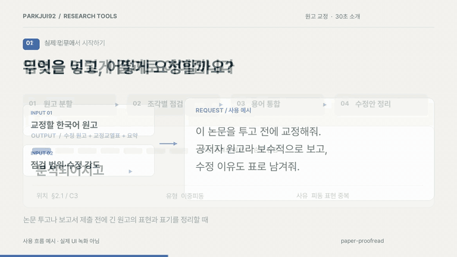

# paper-proofread

[](CHANGELOG.md)
[](LICENSE)


[한국어](README.md) · **English**

A [Claude Code](https://claude.com/claude-code) skill that proofreads Korean academic manuscripts (`.docx` · `.pdf` · `.md` · `.hwp`) for you.

Hand it a draft and it **checks about 2,000 characters at a time, in order, at paragraph boundaries.** It records edits as it goes, then brings them together with terminology checks. Each suggestion includes its location, original wording, proposed change, and reason so the author can decide what to accept.

## 30-second introduction (Korean)

[](docs/media/intro.mp4)

[Watch the video](docs/media/intro.mp4) · [Static image](docs/media/intro-poster.png) · [Transcript and sources (Korean)](docs/media/README.md)

This silent motion graphic illustrates the documented rules; it is not a recording of an actual run. After installation, try the [fictional practice manuscript](examples/intro-manuscript.md). Choose a review scope and strictness, inspect the correction table, and decide which edits to accept. Checking whether cited works exist is optional and off by default.

## What it looks at

Four things.

- **Spelling and spacing** — misspellings, where words join and where they break, loanword transliteration, numbers and units. Where two spellings are both correct (시도해 보다 / 시도해보다), the question isn't which one is right but whether your manuscript picks one and stays with it
- **Awkward sentences** — rules focus on recurring issues in Korean academic writing:
  - *Double passives* — 분석되어지고. 되다 already makes the verb passive, then -어지다 makes it passive a second time. It breaks the rule, but it's so ordinary in academic Korean that it reads as normal
  - *Translationese* — 연구에 있어서 ("in regard to the study"), ~로 사료된다 ("it is deemed that"). Nothing is grammatically wrong, so a spell checker waves it through. The sentence just runs longer and the claim gets fuzzier
  - *Subject–predicate drift* — Korean puts the verb at the end and lets you stack modifying clauses in front of it. Stack enough and the subject stops agreeing with its verb — and the author, who knows what the sentence was meant to say, is the last person to see it
- **Logic and terminology** — whether paragraphs hold together, whether one term stays one term across a long draft (기술이전 in chapter 2, 기술 이전 in chapter 5), whether table numbers match what the body refers to
- **Citations and references** — every in-text citation accounted for in the list, and nothing sitting in the list that the body never cites

There's **one more you can switch on**: checking that the works you cite actually exist. It opens each DOI and link for real and compares what comes back against your reference list. **If AI helped with the draft or the literature, please turn this on** — AI invents plausible papers that were never written, and the author name reads naturally, so does the journal, and the bibliographic formatting is often *tidier* than what a person types by hand. That's exactly why your eye slides past it.

## Install

```bash
# A. git clone (recommended — you can pull new versions later)
mkdir -p ~/.claude/skills && cd ~/.claude/skills && git clone https://github.com/parkjui92/paper-proofread.git
# B. just the files (no git)
mkdir -p ~/.claude/skills/paper-proofread && cd ~/.claude/skills/paper-proofread
curl -L -o paper-proofread.skill https://github.com/parkjui92/paper-proofread/raw/main/paper-proofread.skill
unzip paper-proofread.skill && rm paper-proofread.skill
```

Then restart Claude Code. If you can see `~/.claude/skills/paper-proofread/SKILL.md`, you're set.

## Using it

You don't need to memorize any commands. Just ask in plain language.

```
Proofread this paper before I submit it. The .docx is attached.  ← all four (non-papers work too)
Also check that the references are real works                    ← existence checking on
Just spelling and spacing, quickly                               ← pick one of the four
This is a co-author's draft, so be conservative                  ← only the must-fix items
(the trigger words are Korean apart from "proofreading" — include that word, or call the skill by name)
```

You can set the options below by hand, but asking in words like the above sets them for you.

| Option | Default | What it means |
|---|---|---|
| `strictness` | moderate | How picky to be — `conservative` (🔴 only) / `moderate` (🔴🟡) / `aggressive` (🔴🟡🔵) |
| `focus` | full | What to look at — `full` / `surface` (spelling) / `sentence` / `reference` (citations) |
| `verify_references` | off | On means it checks whether the cited works really exist (needs internet) |
| `chunk_size` · `citation_style` | 2000 chars · APA 7th | How much to read at a time (cut so paragraphs stay whole) · citation format |

## What you get back

Everything worth changing comes back as a table like this.

| # | Location | Sev. | Type | Original | Suggested | Reason |
|---|------|--------|------|------|--------|------|
| 1 | §2.1/C3 | 🔴 | Double passive | 분석되어지고 | 분석되고 | Passive marked twice |
| 2 | §3.2/C5 | 🟡 | Translationese | ~에 있어서 | ~에서 | Reads like a direct translation from English |
| 3 | References | 🔴 | Possibly not real | (list item 12) | — | DOI doesn't open, and that volume has no such paper |

There are three severity levels. 🔴 means **you have to fix it**, 🟡 means **better if you do**, 🔵 is **a matter of taste**. The location column reads `§2.1/C3` — section 2.1, third piece — so you can go straight to the spot in your own file.

You don't only get the table. A **corrected manuscript** with the changes applied comes with it, plus a **summary report** of which mistakes kept recurring and which terms drifted apart across the draft. That "recurring patterns" part is worth a look — it doesn't just fix this manuscript, it changes the next one.

→ [Why I built this, and fuller usage notes](docs/why.md)

## Good to know

- Works on Claude Code (your own machine) and on claude.ai. If a program needed to read `.docx` · `.pdf` · `.hwp` isn't there, it falls back to another way on its own and tells you which one it used.
- **Bibliographic lookup and AI processing are different.** The skill instructs reference lookups to use only titles, authors, and DOIs. Proofreading itself runs through your chosen AI service; this skill does not guarantee local-only processing or prevent the service from receiving manuscript content.
- **It misses things, and it flags things that were fine.** The correction table isn't a set of decisions, it's a list asking you to take a look. Results marked "unverified" by the existence check (Korean journals without DOIs, papers behind a paywall) don't mean something is wrong either — they mean a person needs to check.
- **It doesn't touch your content.** It works on wording and format only. Whether the argument holds and the methodology is sound belongs to the review stages in [socsci-paper-kit](https://github.com/parkjui92/socsci-paper-kit) — and that kit **calls this skill** when its finalizer polishes a draft.
- Further reading — [SKILL.md](SKILL.md) (the instructions the skill actually follows) · [references/rules_ko.md](references/rules_ko.md) (14 translationese patterns and the rest of the Korean rules) · [CHANGELOG.md](CHANGELOG.md) (what changed in each version)

## Related work

**Plugins that write reports and proposals** — [policy-research-kit](https://github.com/parkjui92/policy-research-kit) (policy research reports) · [rnd-proposal-kit](https://github.com/parkjui92/rnd-proposal-kit) (Korean government R&D proposals) · [socsci-paper-kit](https://github.com/parkjui92/socsci-paper-kit) (social science papers)

**Plugins that build and edit** — [lecture-deck-kit](https://github.com/parkjui92/lecture-deck-kit) (HTML lecture slides you edit right in the browser)

**Single-purpose tools** — [fact-verify](https://github.com/parkjui92/fact-verify) (check whether sources are real) · **paper-proofread** (this repository) · [form-tailor](https://github.com/parkjui92/form-tailor) (match an organization's document format) · [report-to-brief](https://github.com/parkjui92/report-to-brief) (shorten long reports)

## License

[MIT](LICENSE)
